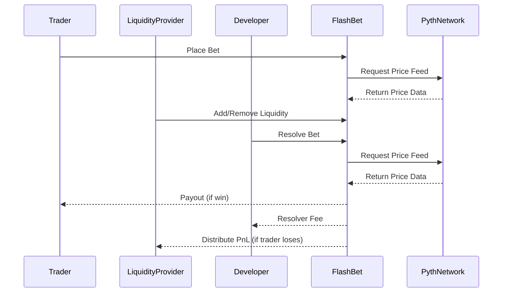

# FlashBet Protocol

**FlashBet** is a fully decentralized, non-custodial prediction market protocol built on [Etherlink](https://www.etherlink.com/). It is open to anyone to be a trader, liquidity provider, or developer, with robust mechanisms for liquidity safety, fair payouts, and gas-efficient reward distribution. FlashBet uses the [Pyth Network](pyth.network) as its oracle provider for secure and reliable price feeds.

## Features

1. **Locked Liquidity for Guaranteed Payouts**:
Liquidity is locked for each bet, so winning traders are always paid out.

2. **Liquidity Protection & Utilization Guard**:
   When the protocol's liquidity utilization rate exceeds 80%, trading is automatically suspended until enough liquidity is released, protecting everyone involved.

3. **Open Community Participation**:
    - **Traders:** Make predictions to profit.
    - **Liquidity Providers:** Provide liquidity to earn a share of protocol profits.
    - **Developers:** Create scripts to resolve bets and earn a 1% resolver fee of each bet value.

4. **Efficient Pull-Based Liquidity Mechanism**:
When the trader loses, their funds are distributed to liquidity providers. Instead of a gas-wasting push model, FlashBet uses a pull-based Batog algorithm (you can read more about it [here](https://batog.info/papers/scalable-reward-distribution.pdf)) that allows providers to claim rewards efficiently.

5. **Fully Decentralized**:
   Complete core logic on-chain, without any centralized control or custody. Built on Etherlink and powered by Pyth Network oracles.

## Actors & Flow

